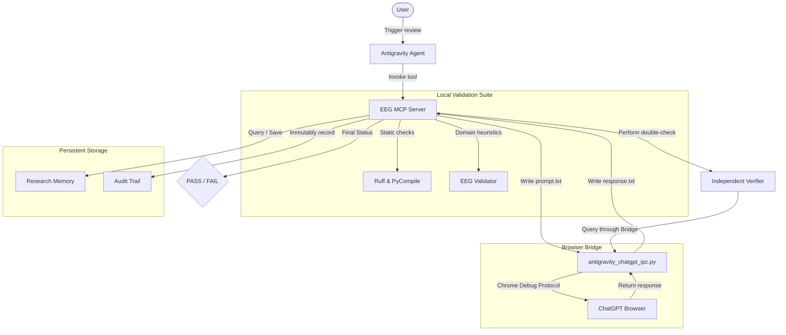

# System Architecture Specification

Below is the visual block diagram and communication interface overview for the EEG Autonomous Engineering Pipeline v1.0.

## 🔄 Interaction Diagram

---

## 📞 Communication Protocols

1. **User ↔ Antigravity**: Uses MCP-enabled IDE commands to launch reviews.
2. **Antigravity ↔ MCP Server**: Uses JSON-RPC standard MCP commands over standard I/O pipes.
3. **MCP Server ↔ Browser Bridge**: Leverages standard file-system IPC (`scratch/prompt.txt` & `scratch/response.txt`) polled synchronously at 1-second intervals.
4. **Browser Bridge ↔ ChatGPT**: Playwright chromium context communicating directly with the ChatGPT DOM interface using Chrome DevTools Protocol.
